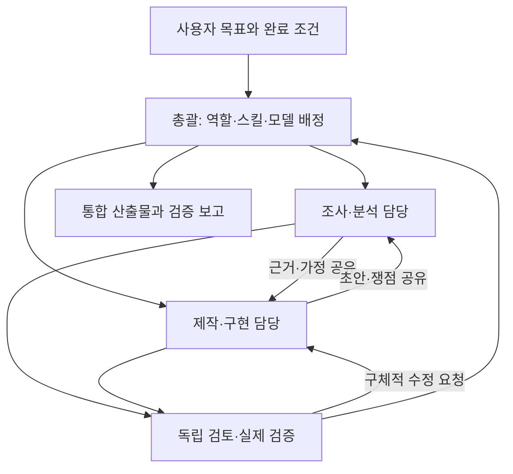

# Codex Orchestrator Kit

**사용자가 전문가 협업을 요청하면 총괄이 과업에 맞는 역할과 모델을 고르고, 동료 간 검토부터 결과 통합·검증까지 조율하는 Codex 스킬입니다.**

개발, 조사, 사업 분석, 창작, 교육, 문서·데이터 제작, 업무 운영에 사용할 수 있는 37개 역할 정의를 포함합니다. 현재 설치된 스킬을 과업에 맞게 연결하는 기준과 협업 예시도 제공합니다. Codex 앱·CLI에서 사용하는 `$orchestrate` 스킬과, 별도 Windows CLI 창을 연결하는 `codex-team` 실행기가 함께 들어 있습니다. 개인 제작 도구이며 OpenAI 공식 제품이 아닙니다.

## 동작 방식



예를 들어 새 기능은 제품 기획, 개발, QA가 협업하고, 사업 제안서는 조사, 재무 모델, 문서 제작, 근거 검토가 협업할 수 있습니다. 동료는 필요한 질문·근거·초안·검토 결과를 직접 주고받고, 총괄은 범위와 공유 파일의 담당자를 결정합니다. 실제 결과를 확인해 수정이 필요하면 작성자에게 돌려줍니다.

역할, 모델, 추론 수준, 사용할 스킬은 별개로 고릅니다. 이 스킬의 역할 TOML에는 모델을 고정하지 않았습니다. 현재 하위 에이전트 도구가 지원하는 모델과 추론 수준이 기준이며, 이 스킬에서 확인한 후보는 다음 다섯 가지입니다.

| 후보 모델 | 배정의 출발점 |
|---|---|
| `gpt-6-luna` | 범위가 좁은 추출·분류·요약과 반복 점검 |
| `gpt-6-sol` | 일반 구현, 문서 제작, 분석과 업무 설계 |
| `gpt-6-astra` | 불확실성이 큰 설계, 원인 분석과 중요한 검토 |
| `gpt-5.6-sol` | 기존 결과 재현, 사용자 선호 또는 지원되는 대체 작업 |
| `gpt-5.6-terra` | 기존 결과 재현, 사용자 선호 또는 일반 문서·업무 작업 |

이는 모든 계정에서 다섯 모델을 쓸 수 있다는 약속이나 성능 순위가 아닙니다. 총괄은 현재 런타임의 지원 목록을 확인해 작업별 모델과 추론 수준을 선택하고, 새 근거나 작업 단계에 따라 후속 배정을 바꿀 수 있습니다. 사용자가 제시한 배치는 기본 선호로 반영하지만, “이 모델만”, “변경 금지”처럼 명시한 고정 조건은 지킵니다. 메인 대화의 모델을 특정 모델로 강제하지 않으며 스킬이 이를 자동 변경하지도 않습니다. [모델 정책](skills/orchestrate/references/models.md)에 선택·인계 기준이 있습니다.

## 빠른 시작: 스킬만 설치

Codex의 스킬 설치 기능에 다음과 같이 요청할 수 있습니다.

```text
$skill-installer https://github.com/yoyowasi/codex-orchestrator-kit/tree/main/skills/orchestrate 에 있는 스킬을 설치해줘.
```

수동으로 설치하려면 저장소의 `skills/orchestrate` 폴더 전체를 개인 스킬 디렉터리 `~/.agents/skills/orchestrate`에 복사합니다. 역할 지침도 스킬 안에 포함되어 있어 별도 전역 역할 등록 없이 읽어 사용할 수 있습니다. 이 TOML들은 지침 자료이며, 폴더에 놓는 것만으로 네이티브 커스텀 에이전트가 자동 등록되지는 않습니다. 생성 도구가 역할 이름을 지원하지 않으면 총괄이 필요한 역할 지침을 작업 배정에 전달합니다.

프로젝트에서 새 Codex 대화를 열고 다음처럼 요청합니다.

```text
$orchestrate 이 프로젝트에 회원가입과 로그인 기능을 만들어줘.
필요한 전문가와 작업별 모델을 고르고 파일 담당을 나눠
구현·동료 검토·검증까지 진행해줘.
```

개발 외 업무도 같은 방식으로 요청할 수 있습니다.

```text
$orchestrate 제공한 고객 의견과 비용 자료로 사업 제안서를 만들어줘.
사용자 인사이트, 재무 시나리오, 문서 제작과 근거 검토를 나눠 진행해줘.
```

하위 에이전트의 생성·모델 선택·동료 메시지 기능은 사용하는 Codex 환경에 따라 다릅니다. 스킬이 보이지 않으면 Codex를 다시 시작합니다.

## 역할 별칭까지 설치

Python 3.11 이상이 필요합니다. 저장소를 내려받고 루트에서 실행합니다.

```sh
git clone https://github.com/yoyowasi/codex-orchestrator-kit.git
cd codex-orchestrator-kit
```

Windows:

```powershell
py -3 scripts/install.py
```

macOS / Linux:

```sh
python3 scripts/install.py
```

설치기는 스킬을 `~/.agents/skills/orchestrate`, 역할 별칭 37개를 `$CODEX_HOME/agents`에 복사합니다. `CODEX_HOME`이 없으면 `~/.codex/agents`를 사용합니다. 계정 인증 정보나 `config.toml`은 변경하지 않습니다.

| 옵션 | 동작 |
|---|---|
| `--dry-run` | 파일을 쓰지 않고 설치 대상 확인 |
| `--force` | 내용이 다른 기존 파일을 백업한 뒤 교체 |
| `--skills-dir PATH` | 스킬 설치 디렉터리 지정 |
| `--codex-home PATH` | 역할과 CLI 상태의 Codex 홈 지정 |
| `--with-cli` | Windows용 여러 창 실행기도 설치 |
| `--bin-dir PATH` | `codex-team.cmd`를 둘 디렉터리 지정 |

기존 파일과 내용이 다르면 기본적으로 설치를 멈춥니다. 업데이트는 내용을 확인한 뒤 `--force`를 사용합니다. 백업 경로와 원래 경로 목록이 출력됩니다. 이전에 `~/.codex/skills/orchestrate`에 설치했다면 `--skills-dir`로 그 스킬 디렉터리를 지정해 동명 스킬이 중복 등록되지 않게 합니다.

## 여러 CLI 창으로 보기

`codex-team`은 스킬의 내장 하위 에이전트 협업과 **별도인 Windows 실행기**입니다. Windows에서 Node.js 22 이상, Python 3.11 이상, 설치·로그인된 Codex CLI가 필요합니다.

```powershell
py -3 scripts/install.py --with-cli
codex-team start C:\projects\my-app
```

기본 구성은 총괄·프론트엔드·백엔드·QA의 네 창입니다. 총괄 `orchestrator` 창에 요청을 입력하면 연결된 로컬 도구가 이미 열린 작업자 창에 작업을 전달합니다. 창을 여는 것만으로 작업은 시작하지 않습니다. `codex-team` 명령을 찾지 못하면 설치기가 출력한 실행기 전체 경로로 실행하거나 해당 디렉터리를 사용자 PATH에 추가합니다. 처음 연결하는 MCP 도구의 사용 승인이 표시될 수 있습니다.

**이 실행기의 현재 모델 지원은 `gpt-6-sol`/medium과 `gpt-6-astra`/high 두 조합입니다.** 총괄 창은 Astra High로 시작하고 작업자는 Sol Medium으로 시작하며, `team_dispatch`에서 이 두 조합 사이를 작업별로 선택합니다. 내장 하위 에이전트 스킬의 다섯 모델 후보와 유연한 선택 정책이 Windows 실행기의 코드에 자동 적용되는 것은 아닙니다. 실행기는 별도 내장 하위 에이전트를 추가 생성하지 않습니다. [여러 창 실행기 사용법](docs/cli-team.md)을 참고하세요.

## 포함된 역할

| 분야 | 역할 |
|---|---|
| 총괄·설계 | `orchestrator`, `architect` |
| 조사·의사결정 | `researcher`, `evidence_reviewer`, `business_analyst`, `user_insights_analyst`, `financial_modeler`, `product_manager` |
| 업무 운영 | `operations_designer`, `automation_engineer`, `app_operator`, `devops_engineer` |
| 콘텐츠·교육 | `content_strategist`, `creative_writer`, `localization_editor`, `learning_designer`, `technical_writer` |
| 문서·데이터 | `data_analyst`, `document_producer`, `spreadsheet_modeler`, `pdf_specialist`, `presentation_designer`, `template_author` |
| 시각·웹 | `visual_creator`, `ux_designer`, `accessibility_auditor`, `sites_builder`, `frontend_developer` |
| 서버·시스템 | `backend_developer`, `database_engineer`, `performance_engineer` |
| Codex 확장 | `openai_solution_designer`, `skill_author`, `plugin_developer` |
| 코드 품질 | `qa_engineer`, `reviewer`, `security_reviewer` |

역할이 직접 대응하는 전용 스킬을 가져야 하는 것은 아닙니다. 문서, PDF, 스프레드시트, 발표 자료, 비트맵 이미지, Sites, 스킬·플러그인 제작 등은 현재 설치된 스킬을 작업 조건에 맞춰 연결합니다. 열려 있는 Excel 앱과 독립 스프레드시트 파일, 기존 Site와 일반 웹 저장소처럼 적용 범위가 다른 도구는 [스킬 연결 기준](skills/orchestrate/references/skill-routing.md)에서 구분합니다. [상세 역할 목록](skills/orchestrate/references/roles.md)에는 역할별 책임과 산출물이 있습니다.

## 구조

```text
skills/orchestrate/          독립 설치 가능한 스킬
  SKILL.md                  팀 구성·배정·통합 지침
  agents/openai.yaml        Codex 표시용 메타데이터
  references/              모델·협업·스킬 연결·업무 예시
  references/roles/         총괄 포함 37개 역할 정의
scripts/install.py          스킬·역할·선택적 실행기 설치
tools/codex-team/            Windows CLI 팀 실행기와 로컬 MCP 서버
tests/                      설치와 작업 배정 로직 검증
docs/cli-team.md             실행기 사용법과 동작 범위
```

## 검증

계정이나 모델 호출 없이 실행할 수 있는 검증입니다.

```powershell
py -3 -m unittest discover -s tests -p "test_*.py"
node --check tools/codex-team/codex-team.mjs
node tests/team.test.mjs
```

macOS / Linux에서는 `py -3` 대신 `python3`를 사용합니다. 테스트는 설치 대상 분리, 충돌 시 기존 파일 보존, 업데이트 백업, 경로 소유권 충돌, 모델 배정 인수를 확인합니다. 실제 모델의 판단 품질이나 모든 계정에서의 실행을 보장하지는 않습니다.

## 현재 동작 범위

- 스킬은 Codex가 제공하는 하위 에이전트 도구를 사용합니다. 생성·모델 선택·동료 메시지와 읽기 전용 샌드박스 지원 여부는 현재 실행 환경에 따릅니다.
- 여러 창 실행기는 Windows용이며 Codex CLI **0.156.0**에서 세션 생성·재연결과 MCP 연결을 확인했습니다. App Server의 WebSocket 인터페이스는 실험적이므로 CLI 업데이트 시 재확인이 필요할 수 있습니다.
- 여러 창의 작업자는 같은 프로젝트 디렉터리를 공유합니다. 파일 담당 예약은 협업 규칙이며 작업자별 파일 접근을 강제로 격리하는 기능은 아닙니다.
- 실행기는 로컬 `127.0.0.1` 서버를 사용합니다. 이를 외부 네트워크에 공개하는 용도로 설계하지 않았습니다.
- 총괄의 모델 선택, 작업 배정, 검토를 지원하며 파일 변경·명령 실행 등의 Codex 승인 절차를 유지합니다. 역할은 외부 계정 접근, 메시지 발송 또는 게시 권한을 새로 부여하지 않습니다.

공식 참고: [스킬](https://learn.chatgpt.com/docs/build-skills), [하위 에이전트](https://learn.chatgpt.com/docs/agent-configuration/subagents), [App Server](https://learn.chatgpt.com/docs/app-server).
