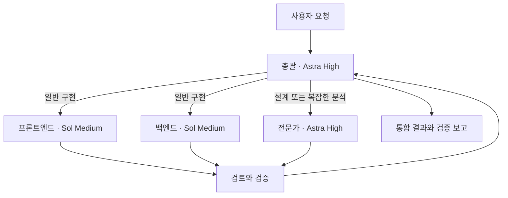

# Codex Orchestrator Kit

**한 번 지시하면 총괄이 전문가와 모델을 선택하고, 작업 배분부터 통합·검증까지 조율하는 Codex 스킬입니다.**

총괄을 포함한 20개 역할 정의와 작업별 모델 선택 정책을 제공합니다. Codex 앱·CLI에서 사용하는 `$orchestrate` 스킬과, 여러 실제 터미널 창을 연결하는 Windows용 `codex-team` 실행기가 들어 있습니다. 개인 제작 도구이며 OpenAI 공식 제품이 아닙니다.

## 동작 방식



총괄은 **역할과 모델을 따로 선택**합니다. 백엔드 개발자에게도 단순 API 구현은 Sol Medium, 복잡한 동시성 오류 분석은 Astra High를 배정할 수 있습니다. 작업이 끝난 뒤 다음 배정에서 모델을 바꿀 수 있습니다.

| 작업 | 모델 | 추론 수준 |
|---|---|---|
| 총괄 | `gpt-6-astra` | `high` |
| 일반 구현·반복 수정·단순 테스트·문서 작성 | `gpt-6-sol` | `medium` |
| 설계·복잡한 원인 분석·중요한 검토 | `gpt-6-astra` | `high` |

요청한 모델을 사용할 수 있는 Codex 계정과 모델 선택을 지원하는 하위 에이전트 기능이 필요합니다. 각 에이전트의 사용량은 계정 한도에 반영됩니다.

## 빠른 시작: 스킬만 설치

Codex의 스킬 설치 기능에 다음과 같이 요청할 수 있습니다.

```text
$skill-installer https://github.com/yoyowasi/codex-orchestrator-kit/tree/main/skills/orchestrate 에 있는 스킬을 설치해줘.
```

수동으로 설치하려면 저장소의 `skills/orchestrate` 폴더 전체를 개인 스킬 디렉터리 `~/.agents/skills/orchestrate`에 복사합니다. 역할 지침도 스킬 안에 포함되어 있어 별도 전역 역할 등록 없이 읽어 사용할 수 있습니다. 생성 도구가 역할 이름을 지원하지 않으면 총괄이 해당 역할 지침과 모델 설정을 전달합니다.

프로젝트의 새 Codex 대화를 열고 메인 모델을 **Astra / High**로 선택한 다음 입력합니다.

```text
$orchestrate 이 프로젝트에 회원가입과 로그인 기능을 만들어줘.
필요한 전문가와 작업별 모델을 선택하고,
파일 담당을 나눠 구현·검토·검증까지 진행해줘.
```

메인 모델은 스킬이 자동 변경하지 않습니다. CLI에서는 다음과 같이 시작할 수 있습니다.

```sh
codex -m gpt-6-astra -c model_reasoning_effort=high
```

스킬이 보이지 않으면 Codex를 다시 시작합니다.

## 역할 별칭까지 설치

Python 3.11 이상이 필요합니다. 저장소를 내려받고 루트에서 실행합니다.

```sh
git clone https://github.com/yoyowasi/codex-orchestrator-kit.git
cd codex-orchestrator-kit
```

Windows:

```powershell
py -3 scripts/install.py
```

macOS / Linux:

```sh
python3 scripts/install.py
```

설치기는 스킬을 `~/.agents/skills/orchestrate`, 역할 별칭 20개를 `$CODEX_HOME/agents`에 복사합니다. `CODEX_HOME`이 없으면 `~/.codex/agents`를 사용합니다. 계정 인증 정보나 `config.toml`은 변경하지 않습니다.

| 옵션 | 동작 |
|---|---|
| `--dry-run` | 파일을 쓰지 않고 설치 대상 확인 |
| `--force` | 내용이 다른 기존 파일을 백업한 뒤 교체 |
| `--skills-dir PATH` | 스킬 설치 디렉터리 지정 |
| `--codex-home PATH` | 역할과 CLI 상태의 Codex 홈 지정 |
| `--with-cli` | Windows용 여러 창 실행기도 설치 |
| `--bin-dir PATH` | `codex-team.cmd`를 둘 디렉터리 지정 |

기존 파일과 내용이 다르면 기본적으로 설치를 멈춥니다. 업데이트는 내용을 확인한 뒤 `--force`를 사용합니다. 백업 경로와 원래 경로 목록이 출력됩니다. 이전에 `~/.codex/skills/orchestrate`에 설치했다면 `--skills-dir`로 그 스킬 디렉터리를 지정해 동명 스킬이 중복 등록되지 않게 합니다.

## 여러 CLI 창으로 보기

Windows에서 **Node.js 22 이상**, **Python 3.11 이상**, 설치·로그인된 **Codex CLI**가 필요합니다.

```powershell
py -3 scripts/install.py --with-cli
codex-team start C:\projects\my-app
```

총괄·프론트엔드·백엔드·QA의 네 창이 열립니다. 총괄 `orchestrator` 창에 작업을 입력하면 연결된 로컬 도구가 작업을 전달하고 결과를 읽습니다. `codex-team` 명령을 찾지 못하면 설치기가 출력한 실행기 전체 경로로 실행하거나 해당 디렉터리를 사용자 PATH에 추가합니다.

창을 여는 것만으로 개발 작업은 시작하지 않습니다. 처음 연결하는 MCP 도구의 사용 승인이 표시될 수 있습니다. [여러 창 실행기 사용법](docs/cli-team.md)을 참고하세요.

## 포함된 역할

| 분야 | 역할 |
|---|---|
| 총괄·설계 | orchestrator, architect |
| 구현 | frontend_developer, backend_developer, database_engineer |
| 품질 | qa_engineer, reviewer, security_reviewer |
| 운영·개선 | devops_engineer, performance_engineer, automation_engineer |
| 기획·디자인 | product_manager, ux_designer |
| 조사·분석 | researcher, data_analyst, business_analyst |
| 콘텐츠·교육 | technical_writer, content_strategist, presentation_designer, learning_designer |

[상세 역할 목록과 지침](skills/orchestrate/references/roles.md)

## 구조

```text
skills/orchestrate/          독립 설치 가능한 스킬
  SKILL.md                  총괄 작업 흐름과 모델 배정 정책
  agents/openai.yaml        Codex 표시용 메타데이터
  references/roles/         총괄 포함 20개 역할 정의
scripts/install.py          스킬·역할·선택적 실행기 설치
tools/codex-team/            Windows CLI 팀 실행기와 로컬 MCP 서버
tests/                      설치와 작업 배정 로직 검증
docs/cli-team.md             실행기 사용법과 동작 범위
```

## 검증

계정이나 모델 호출 없이 실행할 수 있는 검증입니다.

```powershell
py -3 -m unittest discover -s tests -p "test_*.py"
node --check tools/codex-team/codex-team.mjs
node tests/team.test.mjs
```

macOS / Linux에서는 `py -3` 대신 `python3`를 사용합니다. 테스트는 설치 대상 분리, 충돌 시 기존 파일 보존, 업데이트 백업, 경로 소유권 충돌, 모델 배정 인수를 확인합니다. 실제 모델의 판단 품질이나 모든 계정에서의 실행을 보장하지는 않습니다.

## 현재 동작 범위

- 스킬 자체는 Codex가 제공하는 하위 에이전트 도구를 사용합니다. 도구와 모델 선택 지원 여부는 실행 환경에 따라 다릅니다.
- 여러 창 실행기는 Windows용이며 Codex CLI **0.156.0**에서 세션 생성·재연결과 MCP 연결을 확인했습니다. App Server의 WebSocket 인터페이스는 실험적이므로 CLI 업데이트 시 재확인이 필요할 수 있습니다.
- 여러 창의 작업자는 같은 프로젝트 디렉터리를 공유합니다. 파일 담당 예약은 협업 규칙이며 작업자별 파일 접근을 강제로 격리하는 기능은 아닙니다.
- 실행기는 로컬 `127.0.0.1` 서버를 사용합니다. 이를 외부 네트워크에 공개하는 용도로 설계하지 않았습니다.
- 총괄의 모델 선택, 작업 배정, 검토를 자동화하며 파일 변경·명령 실행 등의 Codex 승인 절차를 유지합니다.

공식 참고: [스킬](https://learn.chatgpt.com/docs/build-skills), [하위 에이전트](https://learn.chatgpt.com/docs/agent-configuration/subagents), [App Server](https://learn.chatgpt.com/docs/app-server).
